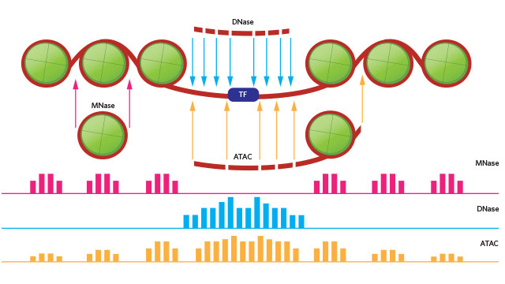
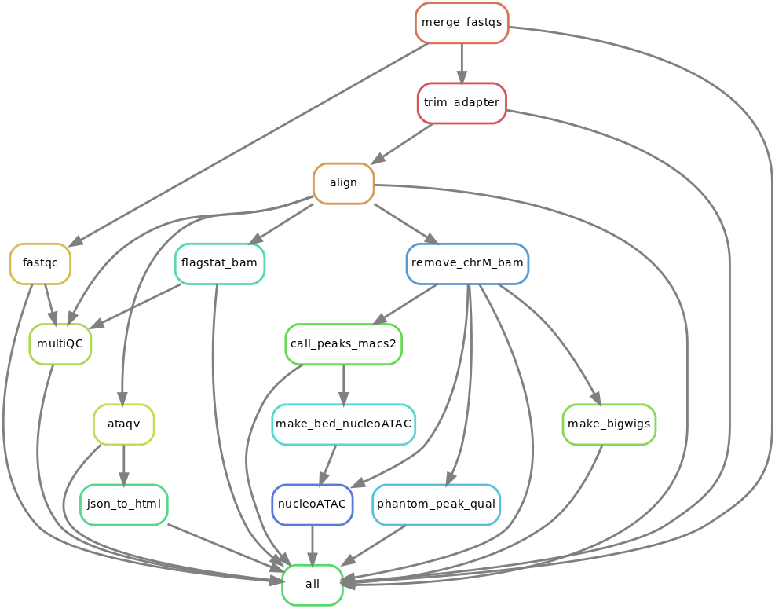

### ATACseq pipeline 

### Understand the method



source: http://www.the-scientist.com/?articles.view/articleNo/44772/title/Reveling-in-the-Revealed/  

https://www.biostars.org/p/209592/

### references

[Ashul lab protocol]( https://docs.google.com/document/d/1f0Cm4vRyDQDu0bMehHD7P7KOMxTOP-HiNoIvL1VcBt8/edit#)

ataqv for QC: https://github.com/ParkerLab/ataqv

### Peak calling

Peaks of read enrichment were mapped using macs2. For ATAC-Seq libraries, reads mapping to chrM were excluded prior to peak calling:

```bash
samtools view -h -F1024 $bam | grep -v -P '\tchrM\t' | samtools view -b - > $tmpBam
macs2 callpeak --keep-dup all -t $tmpBam -n ${bname} 

```

* -f 3: only include alignments marked with the SAM flag 3, which means "properly paired and mapped"  
* -F 4: exclude aligned reads with flag 4: the read itself did not map  
* -F 8: exclude aligned reads with flag 8: their mates did not map  
* -F 256: exclude alignments with flag 256, which means that bwa mapped the read to multiple places in the reference genome, and this alignment is not the best  
* -F 1024: exclude alignments marked with SAM flag 1024, which indicates that the read is an optical or PCR duplicate (this flag would be set by Picard)  
* -F 2048: exclude alignments marked with SAM flag 2048, indicating chimeric alignments, where bwa decided that parts of the read mapped to different regions in the  
genome. These records are the individual aligned segments of the read. They usually indicate structural variation. We're not going to base peak calls on them.


### motif foot-print

https://sites.google.com/site/atacseqpublic/atac-seq-analysis-methods/offsetmethods  

> for peak calling, The paper mentioned "all reads aligning to + strand were offset by +4bp, all reads aligning to the - strand are offset -5 bp". 

> The offsets are only really important when doing TF footprinting using CENTIPEDE. The simplest approach for me was to convert a *bam to *bed (bedtools bamtobed), 
> apply the offset using awk (or whichever method you prefer) and if its useful, convert back to a bam (bedtools bedtobam).

convert bam to bed

```bash
bedtools bamtobed -i bowtie_dup_rm.bam > my.bed
```
Shift the forward reads 4bp and reverse reads 5bp:

```bash
awk 'BEGIN {OFS = "\t"} ; {if ($6 == "+") print $1, $2 + 4, $3 + 4, $4, $5, $6; else print $1, $2 - 5, $3 - 5, $4, $5, $6}' my.bed > my_shifted.bed
```


### work flow of the pipeline

please cite [](https://doi.org/10.5281/zenodo.1043588)




### Dependencies

* [snakemake](https://bitbucket.org/snakemake/snakemake). snakemake is python3
* [bowtie2](bowtie-bio.sourceforge.net/bowtie2/)
* [atactk](http://atactk.readthedocs.io/en/latest/) `trim_adapter`
* [fastqc](https://www.bioinformatics.babraham.ac.uk/projects/fastqc/)
* `bamCoverage` v2.3.3 from [deeptools](https://github.com/fidelram/deepTools) for making RPKM normalized and input subtracted bigwig files
* [bowtie1](http://bowtie-bio.sourceforge.net/index.shtml) for aligning short reads (< 50bp)
* [samblaster](https://github.com/GregoryFaust/samblaster) v0.1.22 to remove duplicates and downsampling.
* [samtools](http://www.htslib.org/) v1.3.1
* [multiQC](http://multiqc.info/)
* [phantompeakqual](https://github.com/kundajelab/phantompeakqualtools)

### How to distribute workflows

read [doc](https://snakemake.readthedocs.io/en/stable/snakefiles/deployment.html)

```bash
ssh shark.mdanderson.org

# start a screen session
screen

# make a folder, name it yourself, I named it workdir
mkdir /rsch2/genomic_med/krai/workdir/

cd /rsch2/genomic_med/krai/workdir/

git clone https://gitlab.com/tangming2005/snakemake_ATACseq_pipeline

cd snakemake_ATACseq_pipeline

## edit the config.yaml file as needed, e.g. set mouse or human for ref genome, p value cut off for peak calling
nano config.yaml

## skip this if on Shark, samir has py351 set up for you. see below STEPS
conda create -n snakemake python=3 snakemake
source activate snakemake
```

## STEPS 

### on Shark

there is a python3 environment set up. just do

```bash
source activate py351
```


### create the sample.json file  by feeding a fastq folder. this folder should be a folder containing all the samples.

please use the **full path** for the folder that contains your fastq folders.

`python3 sample2json.py --fastq_dir /path/to/the/fastq/`

e.g.

```bash
KR_PM374/
├── Sample_ATAC-COAD-hCRC-R1-ATAC--NC-ELO-tEDD1aE31Dg
│   ├── ATAC-COAD-hCRC-R1-ATAC--NC-ELO-tEDD1aE31Dg_S4_L001_R1_001.fastq.gz
│   ├── ATAC-COAD-hCRC-R1-ATAC--NC-ELO-tEDD1aE31Dg_S4_L001_R2_001.fastq.gz
│   ├── ATAC-COAD-hCRC-R1-ATAC--NC-ELO-tEDD1aE31Dg_S4_L002_R1_001.fastq.gz
│   ├── ATAC-COAD-hCRC-R1-ATAC--NC-ELO-tEDD1aE31Dg_S4_L002_R2_001.fastq.gz
│   ├── ATAC-COAD-hCRC-R1-ATAC--NC-ELO-tEDD1aE31Dg_S4_L003_R1_001.fastq.gz
│   ├── ATAC-COAD-hCRC-R1-ATAC--NC-ELO-tEDD1aE31Dg_S4_L003_R2_001.fastq.gz
│   ├── ATAC-COAD-hCRC-R1-ATAC--NC-ELO-tEDD1aE31Dg_S4_L004_R1_001.fastq.gz
│   └── ATAC-COAD-hCRC-R1-ATAC--NC-ELO-tEDD1aE31Dg_S4_L004_R2_001.fastq.gz
├── Sample_ATAC-COAD-m280-R1-ATAC--NC-ELO-t6313a3D02g
│   ├── ATAC-COAD-m280-R1-ATAC--NC-ELO-t6313a3D02g_S1_L001_R1_001.fastq.gz
│   ├── ATAC-COAD-m280-R1-ATAC--NC-ELO-t6313a3D02g_S1_L001_R2_001.fastq.gz
│   ├── ATAC-COAD-m280-R1-ATAC--NC-ELO-t6313a3D02g_S1_L002_R1_001.fastq.gz
│   ├── ATAC-COAD-m280-R1-ATAC--NC-ELO-t6313a3D02g_S1_L002_R2_001.fastq.gz
│   ├── ATAC-COAD-m280-R1-ATAC--NC-ELO-t6313a3D02g_S1_L003_R1_001.fastq.gz
│   ├── ATAC-COAD-m280-R1-ATAC--NC-ELO-t6313a3D02g_S1_L003_R2_001.fastq.gz
│   ├── ATAC-COAD-m280-R1-ATAC--NC-ELO-t6313a3D02g_S1_L004_R1_001.fastq.gz
│   └── ATAC-COAD-m280-R1-ATAC--NC-ELO-t6313a3D02g_S1_L004_R2_001.fastq.gz
├── Sample_ATAC-COAD-m320-R1-ATAC--NC-ELO-t7AECa1D99g
│   ├── ATAC-COAD-m320-R1-ATAC--NC-ELO-t7AECa1D99g_S2_L001_R1_001.fastq.gz
│   ├── ATAC-COAD-m320-R1-ATAC--NC-ELO-t7AECa1D99g_S2_L001_R2_001.fastq.gz
│   ├── ATAC-COAD-m320-R1-ATAC--NC-ELO-t7AECa1D99g_S2_L002_R1_001.fastq.gz
│   ├── ATAC-COAD-m320-R1-ATAC--NC-ELO-t7AECa1D99g_S2_L002_R2_001.fastq.gz
│   ├── ATAC-COAD-m320-R1-ATAC--NC-ELO-t7AECa1D99g_S2_L003_R1_001.fastq.gz
│   ├── ATAC-COAD-m320-R1-ATAC--NC-ELO-t7AECa1D99g_S2_L003_R2_001.fastq.gz
│   ├── ATAC-COAD-m320-R1-ATAC--NC-ELO-t7AECa1D99g_S2_L004_R1_001.fastq.gz
│   └── ATAC-COAD-m320-R1-ATAC--NC-ELO-t7AECa1D99g_S2_L004_R2_001.fastq.gz
└── Sample_ATAC-COAD-mNOD-R1-ATAC--NC-ELO-t076AaFFEDg
    ├── ATAC-COAD-mNOD-R1-ATAC--NC-ELO-t076AaFFEDg_S3_L001_R1_001.fastq.gz
    ├── ATAC-COAD-mNOD-R1-ATAC--NC-ELO-t076AaFFEDg_S3_L001_R2_001.fastq.gz
    ├── ATAC-COAD-mNOD-R1-ATAC--NC-ELO-t076AaFFEDg_S3_L002_R1_001.fastq.gz
    ├── ATAC-COAD-mNOD-R1-ATAC--NC-ELO-t076AaFFEDg_S3_L002_R2_001.fastq.gz
    ├── ATAC-COAD-mNOD-R1-ATAC--NC-ELO-t076AaFFEDg_S3_L003_R1_001.fastq.gz
    ├── ATAC-COAD-mNOD-R1-ATAC--NC-ELO-t076AaFFEDg_S3_L003_R2_001.fastq.gz
    ├── ATAC-COAD-mNOD-R1-ATAC--NC-ELO-t076AaFFEDg_S3_L004_R1_001.fastq.gz
    └── ATAC-COAD-mNOD-R1-ATAC--NC-ELO-t076AaFFEDg_S3_L004_R2_001.fastq.gz

```

### naming conventions of the files

regular expression is used to capture the file name.

inside the `sample2json.py`:

```python
m = re.search(r"-([A-Z]{4})-([A-Z0-9a-z]{4})-[0-9A-Z]{2}-.+_(L[0-9]{3})_(R[12])_[0-9]{3}.fastq.gz", file)
project = m.group(1)
sample = m.group(2)
lane = m.group(3)
# R1 or R2 for forward and reverse read
reads = m.group(4)  

```

check the file information in the json file:

```
less -S samples.json 
```

### dry run to test 

```bash
## dry run
snakemake -np
```

if no errors, preceed below.

### Using [DRMAA](https://www.drmaa.org/)

[job control through drmaa](http://drmaa-python.readthedocs.io/en/latest/tutorials.html#controlling-a-job)

DRMAA is only supported on `Shark`.

```bash
module load drmma
./pyflow-drmaa-ATACseq.sh
```

Using `drmaa` can `control + c` to stop the current run.

Dependent jobs are submitted one by one, if some jobs failed, the pipeline will stop. Good for initital testing.

### submit all jobs to the cluster

```bash
./pyflow-ATACseq.sh 
```

All jobs will be submitted to the cluster on queue.  This is useful if you know your jobs will succeed for most of them and the jobs are on queue to gain priority.

### job control

To kill all of your pending jobs you can use the command:

```bash
bkill ` bjobs -u krai |grep PEND |cut -f1 -d" "`
```

```
      bjobs -pl
       Display detailed information of all pending jobs of the invoker.

      bjobs -ps
       Display only pending and suspended jobs.

      bjobs -u all -a
       Display all jobs of all users.

      bjobs -d -q short -m apple -u mtang1
       Display all the recently finished jobs submitted by john to the
       queue short, and executed on the host apple.
```

### rerun some of the jobs

```bash

# specify the name of the rule, all files that associated with that rule will be rerun. e.g. rerun macs2 calling peaks rule,
./pyflow-ChIPseq -R call_peaks_macs2

## rerun one sample, just specify the name of the target file

./pyflow-ATACseq -R 04aln/m280.sorted.bam

##rerun only align rule
./pyflow-ATACseq -f align

## check snakemake -h
## -R -f -F --until are useufl
```

### checking results after run finish

```bash

snakemake --summary | sort -k1,1 | less -S

# or detailed summary will give you the commands used to generated the output and what input is used
snakemake --detailed-summary | sort -k1,1 > snakemake_run_summary.txt
```


### clean the folders

I use echo to see what will be removed first, then you can remove all later.

```
find . -maxdepth 1 -type d -name "[0-9]*" | xargs echo rm -rf
```


### Snakemake does not trigger re-runs if I add additional input files. What can I do?

Snakemake has a kind of “lazy” policy about added input files if their modification date is older than that of the output files. One reason is that information what to do cannot be inferred just from the input and output files. You need additional information about the last run to be stored. Since behaviour would be inconsistent between cases where that information is available and where it is not, this functionality has been encoded as an extra switch. To trigger updates for jobs with changed input files, you can use the command line argument –list-input-changes in the following way:

```bash
snakemake -n -R `snakemake --list-input-changes`

```

### How do I trigger re-runs for rules with updated code or parameters?

```bash
snakemake -n -R `snakemake --list-params-changes`
```

and

```bash
$ snakemake -n -R `snakemake --list-code-changes`
```


### Peak calling 

by [Tao Liu](https://github.com/taoliu/MACS/issues/145):

>If you followed original protocol for ATAC-Seq, you should get Paired-End reads. If so, I would suggest you just use "--format BAMPE" to let MACS2 pileup the whole fragments in general. But if you want to focus on looking for where the 'cutting sites' are, then '--nomodel --shift -100 --extsize 200' should work.
